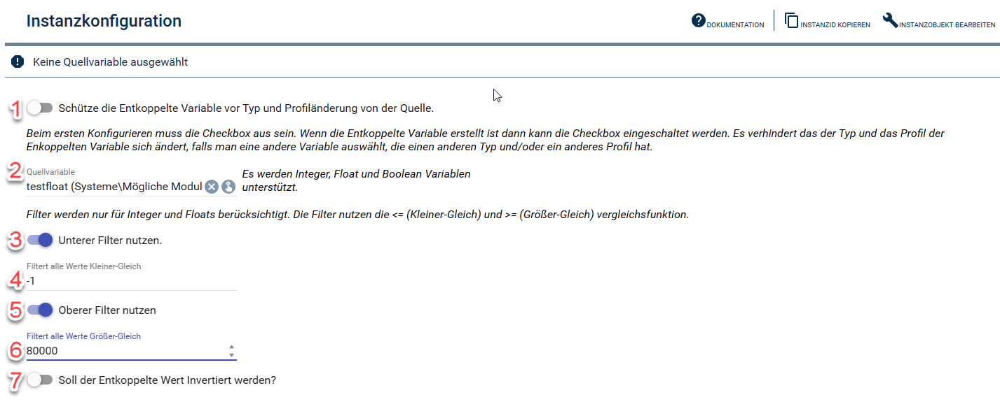

# Konfiguration des Moduls

1. Bei der erst Konfiguration auf deaktiviert lassen. Sonst wird die Entkoppelte Variable nicht erstellt. Wenn die Entkoppelte Variable erstellt wurde kann diese Checkbox aktiviert werden. Das verhindert das die Entkoppelte Variable bei wechsel der Quellvariable ersetzt wird. Man kann z.B. auch von einem Integer auf einen Float (oder umgekehrt) wechseln. Das Ursprüngliche Profil (das Userprofil hat hier vorrang) welches bei der ersten Einrichtung genutzt wurde bleibt so auch erhalten.
2. Auswahl der Variable (Quelle) die Entkoppelt werden soll. Aktuell werden Integer, Float und Boolean unterstützt.
3. Aktivieren des Unteren Filters. Alle Werte Kleiner-Gleich des angegeben Wertes in 4. werden nicht an die Entkoppelte Variable gegeben.
4. Werte Kleiner-Gleich diesen werden ignoriert.
5. Aktivieren des Oberen Filters. Alle Werte Größer-Gleich des angegeben Wertes in 6. werden nicht an die Entkoppelte Variable gegeben.
6. Werte Größer-Gleich diesen werden ignoriert.
7. Kann aktiviert werden um den den Entkoppelten Wert immer zu Invertieren.